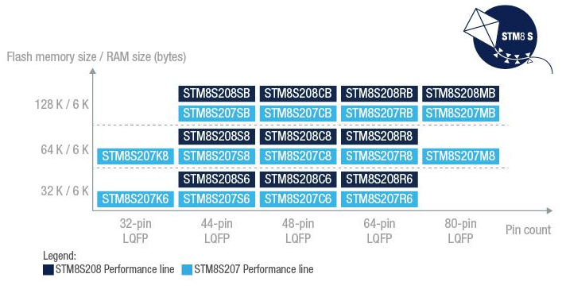

# [STM8S20](https://github.com/sochub/STM8S20)
 
####  qitas@qitas.cn
#### 父级：[STM8S](https://github.com/sochub/STM8S) 
#### 近似：[MCS-51](https://github.com/sochub/MCS-51)

## [描述](https://github.com/sochub/STM8S20/wiki) 

24 MHz主频，包括外设：UART, SPI, I²C等接口, 10-bit ADC, internal and external clock control system, watchdogs, auto wake-up unit

Additional features such as a CAN interface and a second UART are available.

STM8S207/208 封装包括32-80 pin，这也是这个系列最大的特点，可用于大量IO控制的低端设备中。

 

### [资源收录](https://github.com/sochub/STM8S20)

- [文档](docs/)
- [资源](src/)
- [工程](project/)

### [替代方案](https://github.com/sochub/STM8S20)

- [STM32F0](https://github.com/sochub/STM32F0) 
- [CH56](https://github.com/sochub/CH56) 

##  [SoC开发平台](http://www.qitas.cn)  

